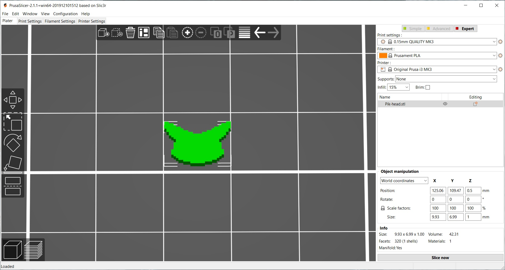

# 1) Pixel art & vases:
 
* [2D pixel art shape](#2d-pixel-art-shape). 
* [Vase body from scatch](#vase-body-from-scatch). 
* [Another vase modifying first scatch](#another-vase-modifying-first-scatch). 
   
## 2D pixel art shape.
I started with a simple search on Google : 
> "2D characters pixel art"
 
I found some interesting anime faces :octocat: but way too complex for what I was supposed to do. I thought a simple pikachu head would be a good start, so here it is:
 

 
And that's how it looks after performing some "editing skills".
 

## Vase body from scatch.
I can't lie to you, I thought it will be a difficult task :worried:. Then I realised that I know some math tricks :sunglasses:.  
I used [Solid of revolution](https://en.wikipedia.org/wiki/Solid_of_revolution) technique. At least I was prepared to, until I saw the "REVOLVE" button that made my life easier :heart:.   

## Another vase modifying first scatch.
