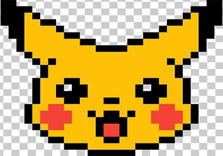

# 1) Pixel art & vases:
 
* 2D pixel art shape. 
* Vase body from scatch. 
* Another vase modifying first scatch. 
   
## 2D pixel art shape.
I started with a simple search on Google : 
> "2D characters pixel art"
 
I found some interesting anime faces :octocat: but way too complex for what I was supposed to do. I thought a simple pikachu head would be a good start, so here it is:
 

 
And that's how it looks after performing some editing skills.
 

## Vase body from scatch.
I can't lie to you, I thought it will be a difficult task :worried:. Then I realised that I know some math tricks 
