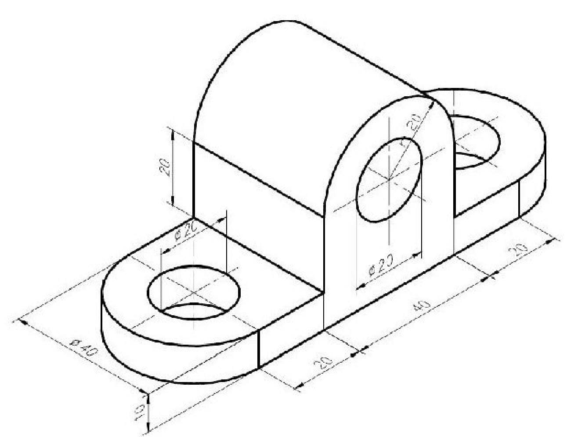

# 2) Improvements & pieces:
 
* [Area 51](#area-51-alien):alien: 
* [Pieces](#pieces-triangular_ruler). 
   
## Area 51 :alien:
I started with a simple search on [Thingiverse](https://www.thingiverse.com/) : 
> "alien"
 
All worked as I expected and I end up with this little blind creature: 
  
Front view: 
 

 
Side view:
 

 
I thought it would be horrible to let him like a mole and I improved his vision.
  
Front view: 
 

 
Side view:
 

  
## Pieces :triangular_ruler:
I reproduced these pieces from the blueprint:  

  

  

  

  

These are scatches made in Fusion360:  

  

  

  

  
